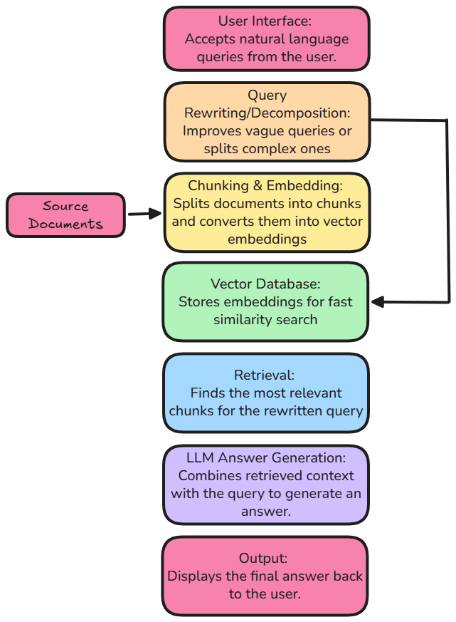

# RAG System Architecture

This document explains the architecture of the student RAG application, matching the Week 16 diagram below.

The system has two paths that meet in the vector database:

1. **Indexing (offline):** source documents are chunked, embedded, and stored.
2. **Query (online):** a user question is rewritten, then used to retrieve similar chunks and generate an answer.

---

## 1. User Interface

The Streamlit app (`app.py`) accepts natural language questions. Before retrieval, the pipeline validates and sanitizes input so unsafe or empty queries never reach the LLM or vector store.

## 2. Query Rewriting / Decomposition

`workflow.py` improves the query **before** it is embedded:

- **Rewriting** turns vague or follow-up questions into a clearer, more specific search query (for example, resolving “it” using conversation history).
- **Decomposition** splits a multi-part question into simpler sub-questions so each part can be retrieved separately (`multi_hop_retrieve()`).

Better query text produces a better embedding, which improves which documents get retrieved.

## 3. Chunking & Embedding

Source documents (`data_loader.py`) are converted into numeric vectors with the embedding model (`embeddings.py`). Each vector represents the meaning of a chunk of text, not just its keywords.

## 4. Vector Database

ChromaDB (`vector_store.py`) stores those embeddings so similar text can be found quickly with nearest-neighbor search. The rewritten query embedding is compared against this store.

## 5. Retrieval

`retrieve_context()` in `rag_pipeline.py` finds the closest document chunks to the rewritten query. Results are then filtered by similarity threshold (`filters.py`) so weakly related documents are dropped instead of being sent to the LLM.

## 6. LLM Answer Generation

Gemini receives the user question plus the retrieved chunks as context (`generate_answer()`). The model is instructed to answer from those documents rather than inventing facts. Monitoring (`monitoring.py`) then scores confidence and checks whether the answer is grounded in the sources.

## 7. Output

The app shows the answer, sources, distances, confidence, and grounding verdict. If nothing relevant was retrieved, a fallback message is returned and the LLM is not called.

---

## How the pieces map to code

| Diagram stage | Main files |
| --- | --- |
| User interface / output | `student-rag-project-main/app.py` |
| Query rewriting / decomposition | `student-rag-project-main/workflow.py` |
| Chunking & embedding | `student-rag-project-main/data_loader.py`, `embeddings.py` |
| Vector database | `student-rag-project-main/vector_store.py` |
| Retrieval, generation, orchestration | `student-rag-project-main/rag_pipeline.py` |
| Filtering & fallbacks | `student-rag-project-main/filters.py` |
